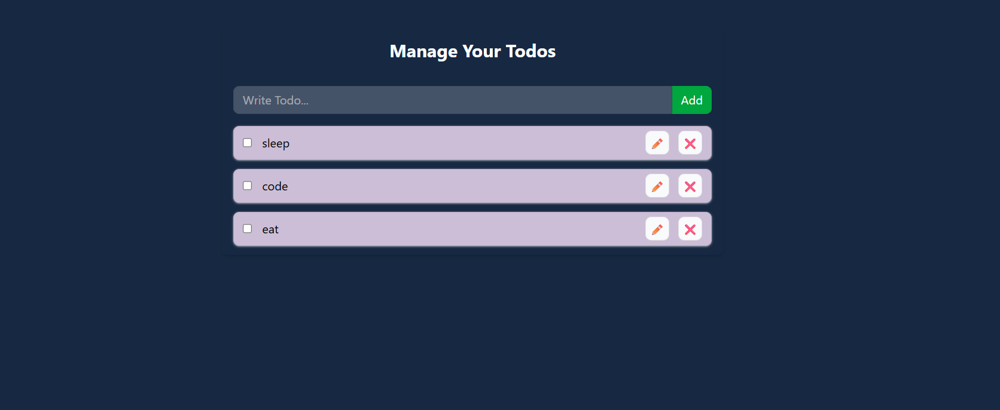
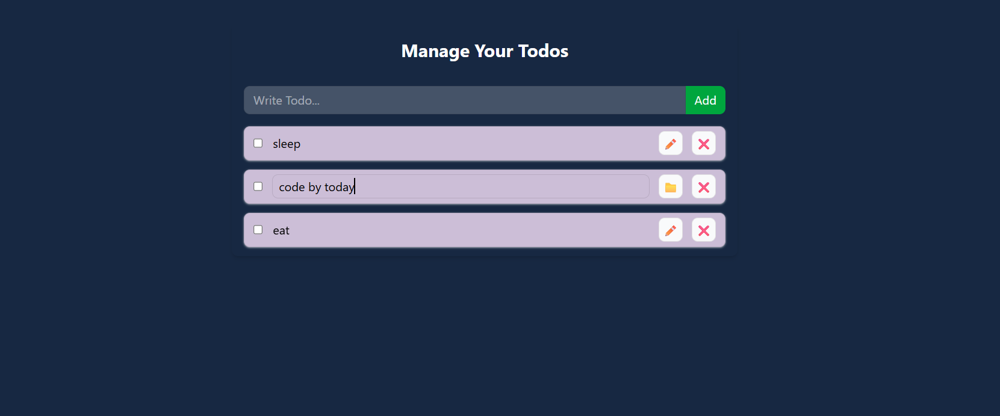
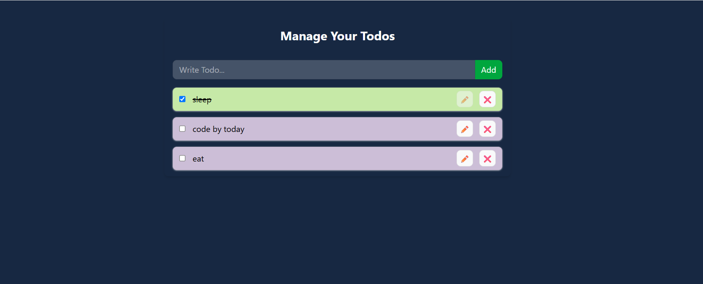

# 📝 React Todo App

A simple and practical **Todo Application built with React** to practice React fundamentals such as **Components, Hooks, Context API, State Management, CRUD operations, and localStorage**.

---

## 📸 Screenshots

Add screenshots of the project inside a `screenshots` folder.

### 🏠 Main Application



### ✏️ Editing a Todo



### ✅ Completed Todo



---

## ✨ Features

- ➕ Add new todos
- ✏️ Edit existing todos
- 💾 Save edited todos
- ✅ Mark todos as completed
- ↩️ Mark completed todos as incomplete
- 🗑️ Delete todos
- 💾 Persist todos using `localStorage`
- 🔄 Restore todos after refreshing the page
- 🎨 Different styling for completed and active todos
- 📱 Responsive interface
- ⚛️ React Context API for shared todo functionality

---

## 🛠️ Technologies Used

- **React**
- **JavaScript (ES6+)**
- **React Hooks**
  - `useState`
  - `useEffect`
  - `useContext`

- **Context API**
- **Tailwind CSS**
- **Vite**
- **Browser localStorage**

---

## 📂 Project Structure

```text
src/
│
├── components/
│   ├── index.js
│   ├── TodoForm.jsx
│   └── TodoItem.jsx
│
├── contexts/
│   └── index.js
│   └── TodoContext.js
│
├── App.jsx
├── index.css
└── main.jsx
```

### Components

#### `App.jsx`

The main component of the application.

It:

- Stores the todo state
- Defines todo operations
- Provides the Context
- Loads todos from localStorage
- Saves todos to localStorage
- Renders the todo list

---

#### `TodoForm.jsx`

Responsible for creating new todos.

It uses:

```js
useState();
```

to manage the input field and:

```js
useTodo();
```

to access the `addTodo()` function from Context.

---

#### `TodoItem.jsx`

Responsible for displaying and managing an individual todo.

It handles:

- Completing a todo
- Editing a todo
- Saving an edited todo
- Deleting a todo

It accesses Context using:

```js
const { updateTodo, deleteTodo, toggleComplete } = useTodo();
```

---

#### `contexts/index.js`

Contains the Todo Context and custom hook.

```js
export const TodoContext = createContext({
  todos: [],
  addTodo: () => {},
  updateTodo: () => {},
  deleteTodo: () => {},
  toggleComplete: () => {},
});
```

The custom hook makes consuming the Context easier:

```js
export const useTodo = () => {
  return useContext(TodoContext);
};
```

---

## ⚛️ React Concepts Used

### 1. `useState`

The application stores todos using:

```js
const [todos, setTodos] = useState([]);
```

The state contains the current list of todos.

---

### 2. `useEffect`

`useEffect` is used to synchronize React state with browser `localStorage`.

Todos are saved whenever the `todos` state changes:

```js
useEffect(() => {
  localStorage.setItem("todos", JSON.stringify(todos));
}, [todos]);
```

---

### 3. Context API

The application uses Context API to share todo data and functions between components.

```text
App
 │
 ▼
TodoProvider
 │
 ├── TodoForm
 │
 └── TodoItem
```

The Provider supplies:

```js
{
  (todos, addTodo, updateTodo, deleteTodo, toggleComplete);
}
```

---

### 4. Custom Hook

Instead of writing:

```js
useContext(TodoContext);
```

throughout the application, a custom hook is created:

```js
useTodo();
```

Components can then simply use:

```js
const { addTodo } = useTodo();
```

---

## 🔄 Application Flow

```text
User Action
    │
    ▼
TodoForm / TodoItem
    │
    ▼
Context Function
    │
    ▼
App.jsx
    │
    ▼
setTodos()
    │
    ▼
React State Updated
    │
    ▼
Component Re-renders
    │
    ▼
Updated Todo List
```

---

## 💾 Local Storage

The application uses the browser's `localStorage` API so todos remain available after refreshing the page.

### Loading Data

When the application starts:

```text
Application starts
       ↓
Read localStorage
       ↓
Convert JSON → JavaScript object
       ↓
Set todos state
       ↓
Render todos
```

### Saving Data

Whenever the todo state changes:

```text
Todo changes
     ↓
todos state updates
     ↓
useEffect runs
     ↓
Convert todos → JSON
     ↓
Save to localStorage
```

The data is stored under:

```text
todos
```

---

## ➕ Adding a Todo

A new todo is created using:

```js
const addTodo = (todo) => {
  setTodos((prev) => [
    {
      id: Date.now(),
      ...todo,
    },
    ...prev,
  ]);
};
```

The new todo receives a unique timestamp-based ID and is added to the beginning of the array.

Example:

```js
{
  id: 1758123456789,
  todo: "Learn React",
  completed: false
}
```

---

## ✏️ Updating a Todo

The application uses `map()` to find the todo that needs to be updated.

```js
setTodos((prev) =>
  prev.map((prevTodo) => (prevTodo.id === id ? updatedTodo : prevTodo)),
);
```

Only the matching todo is replaced.

---

## 🗑️ Deleting a Todo

Deleting uses `filter()`:

```js
setTodos((prev) => prev.filter((todo) => todo.id !== id));
```

The todo with the matching ID is removed from the new array.

---

## ✅ Completing a Todo

The completion status is toggled using:

```js
setTodos((prev) =>
  prev.map((prevTodo) =>
    prevTodo.id === id
      ? {
          ...prevTodo,
          completed: !prevTodo.completed,
        }
      : prevTodo,
  ),
);
```

The spread operator creates a new object instead of directly modifying the existing state.

---

## 🧠 Key React Concepts Practiced

This project helped practice:

- React components
- JSX
- Props
- State
- State updates
- Functional state updates
- Event handling
- Controlled inputs
- Conditional rendering
- Array `map()`
- Array `filter()`
- Object spread operator
- Array spread operator
- Destructuring
- Context API
- `useContext`
- Custom Hooks
- `useState`
- `useEffect`
- localStorage
- Immutable state updates
- Component re-rendering
- Barrel-file exports

---

## 🚀 Installation

### 1. Clone the repository

```bash
git clone <YOUR_REPOSITORY_URL>
```

### 2. Navigate to the project

```bash
cd <PROJECT_FOLDER>
```

### 3. Install dependencies

```bash
npm install
```

### 4. Start the development server

```bash
npm run dev
```

The application will be available at the local URL shown in your terminal.

---

## 🔮 Future Improvements

Some possible improvements for the project:

- 🔍 Search todos
- 🏷️ Add categories
- 🎯 Add priority levels
- 📅 Add due dates
- 📊 Add todo statistics
- 🌙 Add dark/light mode
- 🔐 Add user authentication
- ☁️ Connect to a backend
- 🗄️ Store todos in MongoDB
- 🔄 Sync todos across devices
- 📱 Improve mobile UI

---

## 🎯 Purpose of the Project

This project was built as a **React learning project** to understand how different React concepts work together in a real application.

The main focus was understanding:

```text
State
  ↓
Context API
  ↓
Components
  ↓
User Actions
  ↓
State Updates
  ↓
Re-render
  ↓
localStorage
```

---

## 👨‍💻 Author

**Sayan**

B.Tech CSE Student
Aspiring Software Engineer
PORTFOLIO : https://sayan-dev-portfolio.netlify.app/

---

## ⭐ Acknowledgement

This project was created as part of learning and practicing modern React development.

If you found the project useful, consider giving the repository a ⭐.
